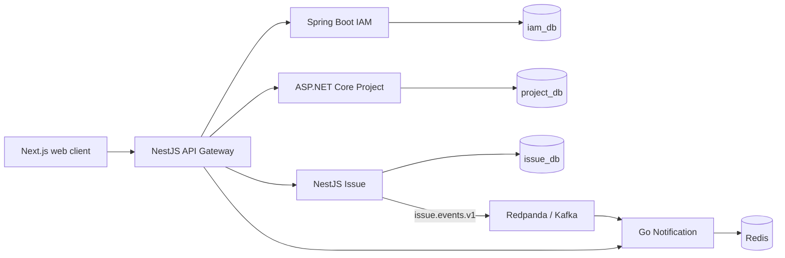

# Jira-like Polyglot Microservices

A learning-oriented Jira-like application built as a polyglot microservices
vertical slice. It demonstrates clear service ownership, synchronous
request-time checks, transactional outbox delivery, Kafka-compatible events,
Redis-backed notifications, and a browser client that calls the API Gateway
only.

## What it supports

- Account registration, login, refresh-token sessions, and logout
- Workspace creation and membership management
- Workspace-scoped projects, including archival
- Issues, comments, assignments, history, epics, and sprints
- A fixed issue workflow with optimistic-concurrency protection
- Event-derived notifications that can be listed and marked as read

The issue workflow is:

```text
TODO -> IN_PROGRESS
IN_PROGRESS -> TODO | DONE
DONE -> IN_PROGRESS
```

`DONE` is reopenable. Archived-project issues remain readable, but applicable
writes are rejected.

## Architecture



| Component | Technology | Responsibility | Port |
| --- | --- | --- | ---: |
| Web client | Next.js / React | Browser UI and client state | 3001 |
| API Gateway | NestJS / Fastify | Public routing, JWT validation, correlation IDs, error translation | 3000 |
| IAM service | Spring Boot / Java | Accounts, passwords, access tokens, refresh sessions | internal 8081 |
| Project service | ASP.NET Core / .NET | Workspaces, memberships, project lifecycle | internal 8082 |
| Issue service | NestJS | Issues, comments, history, planning, transactional outbox | internal 8083 |
| Notification service | Go | Event consumption and recipient notification projection | internal 8084 |

Each service owns its own data. Services communicate through HTTP contracts for
request-time checks and `issue.events.v1` for asynchronous notifications; no
service reads another service's database.

## Run locally

Prerequisites: Docker Desktop with Compose v2, Node.js for the web client, and
an `INTERNAL_SERVICE_SECRET` value for local service-to-service calls.

```powershell
cd infra/docker-compose
Copy-Item .env.example .env
# Set INTERNAL_SERVICE_SECRET in .env
docker compose up --build
```

Verify the stack through the Gateway:

```powershell
Invoke-WebRequest http://localhost:3000/health/services
```

Start the web client in a second terminal:

```powershell
cd apps/web-client
npm ci
npx next dev -H 0.0.0.0 -p 3001
```

Open `http://localhost:3001/register`, create an account, then create a
workspace, project, and issue.

## Repository layout

```text
apps/
  api-gateway-nest/         Public API edge
  iam-service-java/         Identity and session ownership
  project-service-dotnet/   Workspaces, membership, projects
  issue-service-nest/       Issues, planning, outbox publishing
  notification-service-go/  Kafka consumer and Redis projection
  web-client/               Next.js application
contracts/events/           Versioned event schema
infra/docker-compose/       Local runtime topology
scripts/                    Health checks and smoke flows
```

## Engineering boundaries

- The browser communicates with the Gateway only.
- The Gateway remains thin; domain rules stay with their owning service.
- Every request preserves `x-correlation-id` for tracing.
- Passwords, JWTs, refresh tokens, and internal secrets must never be logged
  or committed.
- Cross-service contract, data-owner, or transport changes require an ADR.

## Current scope

This is an MVP and learning project. It intentionally does not yet include
features such as issue deletion, labels, attachments, estimates, server-side
search/filtering, configurable workflows, or real-time notification delivery.
