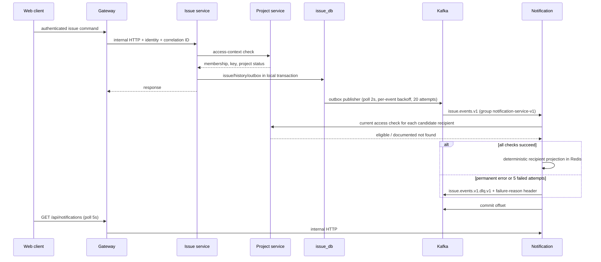

# Data Flow

## Purpose

Explain the main verified request and event paths.

An unavailable Project service blocks Issue requests with a stable 503. An unavailable Kafka broker does not roll back the committed Issue transaction; pending outbox publication retries with per-event exponential backoff (1 s doubling, capped at 5 minutes). After 20 failed attempts an event stops retrying and Issue Service `/health` reports it as abandoned.

Notification processing also makes a synchronous Project Service read while handling an asynchronous Kafka event. A Project outage therefore delays notification projection and can increase Kafka lag, but it does not reverse the already-committed Issue change.
