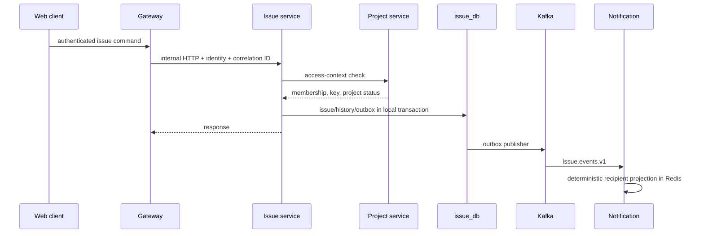

# Data Flow

## Purpose

Explain the main verified request and event paths.

An unavailable Project service blocks Issue requests with a stable 503. An unavailable Kafka broker does not roll back the committed Issue transaction; pending outbox publication retries.
