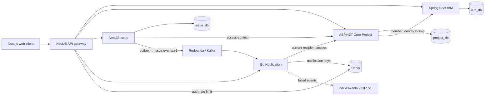

# Architecture Overview

## Purpose

Describe the **VERIFIED** runtime topology and ownership boundaries.

The browser calls the gateway only. Draw.io source and rendered images of this topology and the event flow live in [`diagrams/`](../../diagrams/); see [diagrams](../diagrams/README.md). Each service owns its persistence; local Docker Compose does not make databases shared domain stores. See [module boundaries](module-boundaries.md) and [data overview](../data/database-overview.md).
