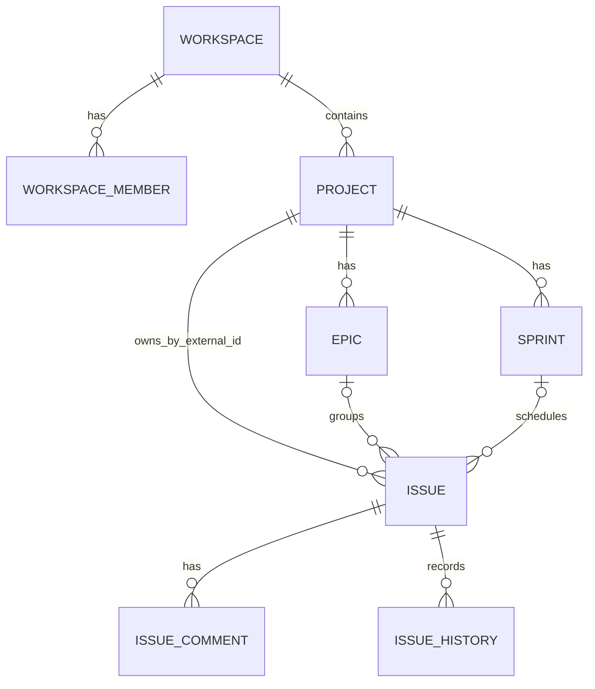

# Relationships

## Purpose

Verified entity relationships. Solid arrows are database foreign keys within an owner; dotted arrows are external IDs/contracts.

User IDs in `project_db` and `issue_db` are external IAM references. Issue `project_id` is an external Project identifier, checked through HTTP. The diagram intentionally omits cross-service foreign keys because they do not exist.
