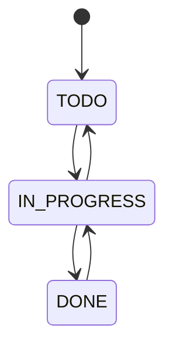

# Issue Lifecycle

## Purpose

Create, view, update, assign, transition, and record collaboration on an issue.

## Actors

- Workspace `MEMBER`
- Workspace `ADMIN`
- Workspace `OWNER`

## Preconditions

Actor belongs to the issue project workspace; project is `ACTIVE` for writes. Archived-project issues remain readable.

## Trigger

An issue command through the Gateway.

## Main Flow

1. Gateway validates JWT and forwards identity/correlation ID to Issue Service.
2. Issue Service asks Project Service for caller access and project status.
3. Creation validates issue content/links and allocates a project sequence/key.
4. Core details, assignment, and transition commands require a positive integer `expectedVersion`. Issue Service performs an early loaded-version conflict check and an authoritative PostgreSQL compare-and-swap update in `issue_db`.
5. It writes action history and an outbox event in the same transaction.
6. Publisher emits the event asynchronously.

## Alternative Flows

### A1 — Assignment

Assignee is optional; a nonempty assignee ID must pass Project access lookup.

### A2 — Transition

The requested status must be a permitted next state.

## Failure / Error Flows

Invalid UUID/content/status/link, inaccessible issue/project, archived project, stale version, invalid transition, or unavailable Project Service are rejected. A stale core mutation returns `409 CONCURRENT_ISSUE_MODIFICATION` without Issue/history/outbox side effects.

## Business Rules

[BR-ISSUE-001](../product/business-rules.md#br-issue-001--project-scoped-identity) through [BR-ISSUE-004](../product/business-rules.md#br-issue-004--change-history-and-delivery-event).

## State Transitions

## Permissions

All verified workspace memberships may read issues of a visible project; active-project access is required for writes. See [matrix](../reference/permissions-matrix.md).

## Data Affected

Issue, project sequence, issue history, outbox event; optional epic/sprint references.

## API Dependencies

`POST/GET /api/projects/{projectId}/issues`, `GET/PATCH /api/issues/{issueId}`, `PATCH /api/issues/{issueId}/assignee`, `POST /api/issues/{issueId}/transitions`.

## UI Entry Points

Backlog and board create/issues; issue detail page edits and assigns.

## Validation

See [issues API](../api/issues.md) and [status reference](../reference/status-reference.md).

## Edge Cases

Issue status `DONE` does not lock further edits/comments/reopening. There is no issue delete endpoint.

## Acceptance Criteria

### AC-ISSUE-001

Given a workspace member and active project, when they create a valid issue, then it starts `TODO` with a unique project-scoped key and history/event records.

## Related Documentation

[assignment flow](issue-assignment.md), [status flow](status-transition.md), [comments](comments-and-activity.md).
