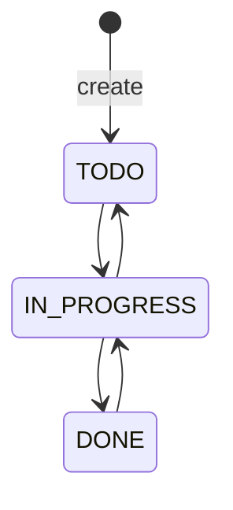

# Issue Status Reference

## Purpose

The fixed, **VERIFIED** issue state machine in `issue-service`.

| Status | Meaning | Allowed previous | Allowed next | Actor allowed | Side effects |
| --- | --- | --- | --- | --- | --- |
| `TODO` | Newly created or returned work | Initial creation; `IN_PROGRESS` | `IN_PROGRESS` | Any visible `MEMBER`, `ADMIN`, or `OWNER` with active-project access | Exactly one `STATUS_CHANGED` history row and one `issue.transitioned` outbox event when transitioned |
| `IN_PROGRESS` | Work underway | `TODO`, `DONE` | `TODO`, `DONE` | Same | Same |
| `DONE` | Work complete | `IN_PROGRESS` | `IN_PROGRESS` | Same | Same |

All `TASK`, `BUG`, and `STORY` Issues use this one graph. Same-state changes and unlisted edges are invalid. No terminal lock exists: completed issues may be edited, reassigned, commented on, and reopened because the code applies only membership/active-project checks. A successful transition increments the Issue version exactly once and commits its status/version mutation, exact-one local history row, and exact-one local outbox row together; Kafka delivery of that outbox event is asynchronous and at-least-once.
