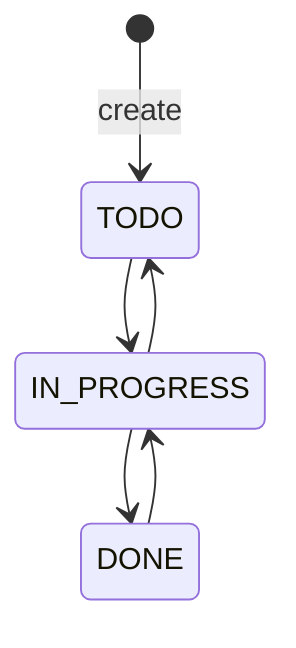

# Issue Status Reference

## Purpose

The fixed, **VERIFIED** issue state machine in `issue-service`.

| Status | Meaning | Allowed previous | Allowed next | Actor allowed | Side effects |
| --- | --- | --- | --- | --- | --- |
| `TODO` | Newly created or returned work | Initial creation; `IN_PROGRESS` | `IN_PROGRESS` | Any member with visible active-project access | History and `issue.transitioned` outbox event when transitioned |
| `IN_PROGRESS` | Work underway | `TODO`, `DONE` | `TODO`, `DONE` | Same | Same |
| `DONE` | Work complete | `IN_PROGRESS` | `IN_PROGRESS` | Same | Same |

No terminal lock exists: completed issues may be edited, reassigned, commented on, and reopened because the code applies only membership/active-project checks.
